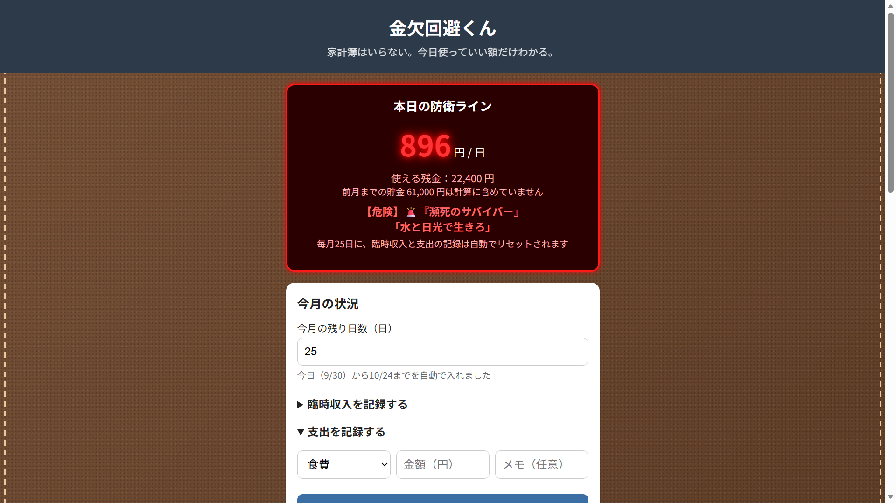

[README.md](https://github.com/user-attachments/files/32792987/README.md)# `<金欠回避くん>`

`<大まかな金額を入れるだけで金欠危険水域を視覚アラートで突きつけ、30秒で危機感を可視化して浪費を防げるアプリです。>`

**公開URL：** `<https://kinketsukaihikunn.vercel.app>`

<!--
スクリーンショットの貼り方：
1. アプリの画面をスクリーンショットで撮る（Windows: Win+Shift+S / Mac: Cmd+Shift+4）
2. 画像ファイルをこのフォルダの screenshot.png という名前で保存する
3. 下の行の <!-- --> 
<!--  -->

---

## こんな人のためのアプリです

`<バイト代は入ってくるのに「気が付いたらお金がない」大学生>`

## 解決する困りごと

`<給料日や散財後「今月あといくら使ったら即アウトか」を知りたい>`

---

## 使い方

1. `<基本設定の欄を埋める>`
2. `<日々の支出を記録する>`
3. `<本日の防衛ラインを超えないように生活しましょう>`
4. `<残高メモを使うとより正確にお金を管理できます>`

---

## 主な機能

| 機能 | 説明 |
|---|---|
| `<基本情報の入力>` | `<基本収入と固定費、残したい金額と貯金額を入力できます。本日の防衛ラインの計算の基本となります。貯金を防衛ライン計算に含むかどうかは選択できます。>` |
| `<臨時収入と支出の記録>` | `<臨時収入や支出を入力すると本日の防衛ラインに反映されます。>` |
| `<残高メモの活用>` | `<各媒体での残高の増減を記録できます。防衛ラインの計算には関わらないので、面倒な方は使わないという選択肢もあります>` |

## 今回は作らなかった機能

- `<具体的な支出用途は記録しないようにして、「何に使ったか思い出せないからつけないでいいや」というようなことが起きにくくしました。>`
- `<このアプリだけで動作を完結できるようにするため、外部アプリとの連携機能は作りませんでした。>`

---

## 使っている技術

- HTML / CSS / JavaScript
- localStorage（データの保存）
- 公開：`<Vercel / GitHub Pages>`

外部のライブラリやフレームワークは使っていません。

---

## AI の使い分け

この作品は、集中講義「生成AIエージェントによるWebアプリ開発入門」で、
生成AIを使って開発しました。

| | 使ったAI | 何に使ったか |
|---|---|---|
| 考える・整理する | Gemini | `<課題の整理、仕様書の下書き、この説明文の下書き>` |
| 実装する・直す | Claude Code | `<画面の実装、機能の追加、不具合の調査と修正>` |
| **決める・確かめる** | **人間（私たち）** | `<何を作るかの決定、AIの提案の採否、動作確認、公開の判断>` |

AI が出した提案のうち、`<採用しなかったもの>` は私たちの判断で却下しました。
最終的な動作確認と公開の判断は、すべてチームのメンバーが行っています。

---

## 開発メンバー

- `<RY>`
- `<WM>`
- `<NC>`

## ローカルで動かす方法

このアプリは HTML / CSS / JavaScript だけでできています。
特別な準備は必要ありません。

1. このリポジトリをダウンロード（または `git clone`）します。
2. `index.html` をブラウザで開きます。

---

## 注意

- データはブラウザに保存されます。**別のブラウザや別の端末では引き継がれません。**
- ブラウザの履歴やサイトデータを削除すると、データも消えます。

